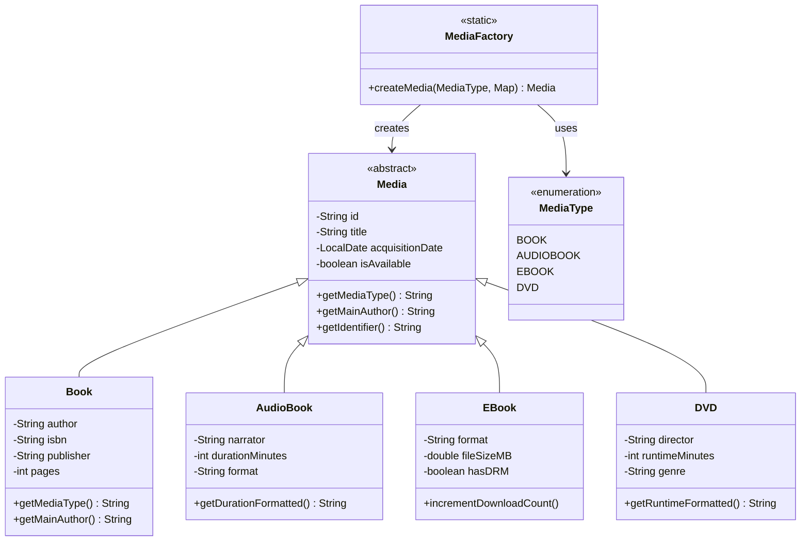
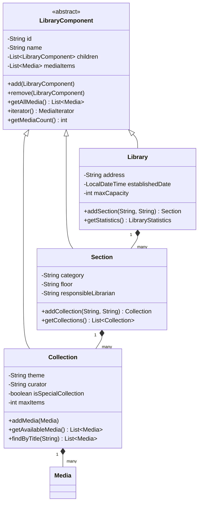
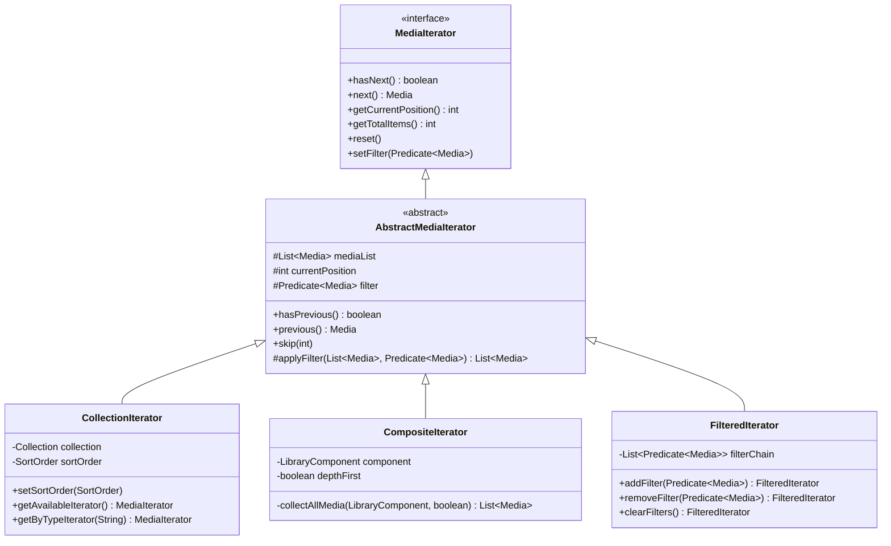
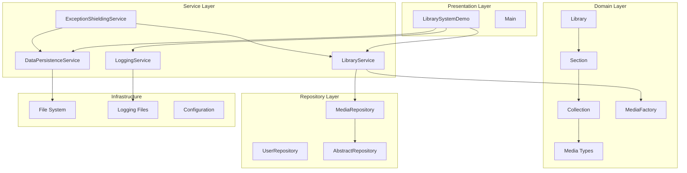
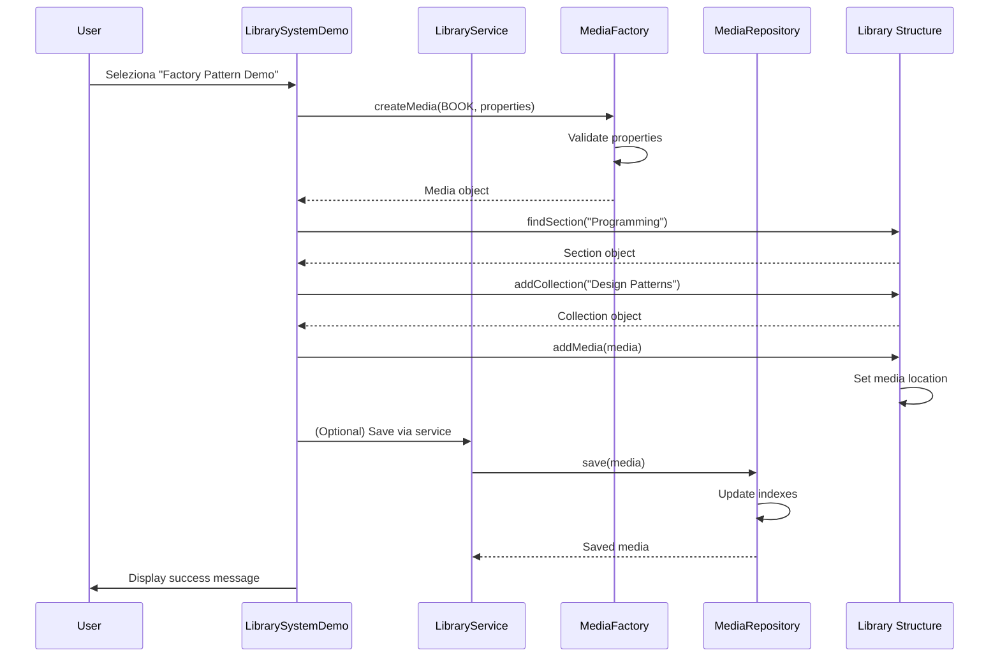

# Digital Library Management System

Un sistema completo di gestione biblioteca digitale che dimostra l'utilizzo di design patterns Java avanzati, tecnologie core e best practices di programmazione.

## 📋 Panoramica dell'Applicazione

Il Digital Library Management System è un'applicazione Java che implementa un sistema completo per la gestione di una biblioteca digitale. Il sistema supporta diversi tipi di media (libri, audiolibri, e-book, DVD) organizzati in una struttura gerarchica di sezioni e collezioni.

### Funzionalità Principali

- **Gestione Media Multi-tipo**: Supporto per libri fisici, audiolibri, e-book e DVD
- **Struttura Gerarchica**: Organizzazione in biblioteca → sezioni → collezioni → media
- **Ricerca Avanzata**: Ricerca per titolo, autore, tipo di media e disponibilità
- **Iterazione Flessibile**: Navigazione attraverso la struttura con filtri personalizzabili
- **Persistenza Dati**: Salvataggio/caricamento con serializzazione binaria e export CSV
- **Sistema di Logging**: Logging strutturato per audit, performance e sicurezza
- **Gestione Errori**: Exception shielding per un'esperienza utente robusta
- **Operazioni Concorrenti**: Thread-safety per accesso multi-utente

### Demo Interattiva

L'applicazione include una demo completa che mostra:
1. 🏭 Factory Pattern - Creazione dinamica di diversi tipi di media
2. 🌳 Composite Pattern - Navigazione della struttura gerarchica
3. 🔄 Iterator Pattern - Iterazione con filtri e ordinamento
4. 🛡️ Exception Shielding - Gestione sicura degli errori
5. 📦 Collections & Generics - Utilizzo avanzato del framework Java
6. 💾 Java I/O - Operazioni di persistenza e backup
7. 📋 Logging - Sistema di logging strutturato
8. 🚀 Advanced Features - Stream API, lambda expressions, multithreading

## 🛠️ Tecnologie e Pattern Utilizzati

### Design Patterns

#### Factory Pattern
**Utilizzo**: Creazione dinamica di oggetti Media
**Giustificazione**: Incapsula la logica di creazione, permettendo l'aggiunta di nuovi tipi di media senza modificare il codice client.

```java
Media book = MediaFactory.createMedia(MediaType.BOOK, properties);
Media audioBook = MediaFactory.createMedia(MediaType.AUDIOBOOK, properties);
```

#### Composite Pattern
**Utilizzo**: Struttura gerarchica Library → Section → Collection → Media
**Giustificazione**: Permette di trattare uniformemente elementi singoli e compositi, facilitando operazioni su tutta la gerarchia.

```java
// Operazioni uniformi su qualsiasi livello
int totalMedia = library.getMediaCount();
MediaIterator iterator = library.iterator();
```

#### Iterator Pattern
**Utilizzo**: Navigazione attraverso collezioni di media
**Giustificazione**: Fornisce un modo uniforme per accedere agli elementi senza esporre la struttura interna.

```java
MediaIterator filtered = collection.iterator(media -> media.isAvailable());
MediaIterator sorted = new CollectionIterator(collection, null, SortOrder.TITLE_ASC);
```

### Tecnologie Core Java

#### Generics e Collections Framework
**Utilizzo**: Repository type-safe e operazioni di collezione
**Giustificazione**: Type safety a compile-time e performance ottimizzate.

```java
public class MediaRepository extends AbstractRepository<Media> {
    Map<String, Set<String>> typeIndex = new ConcurrentHashMap<>();
    List<Media> findByType(String mediaType);
}
```

#### Stream API e Lambda Expressions
**Utilizzo**: Operazioni funzionali su collezioni
**Giustificazione**: Codice più leggibile e operazioni parallele automatiche.

```java
Map<String, Long> typeCount = allMedia.stream()
    .collect(groupingBy(Media::getMediaType, counting()));
```

#### Multithreading
**Utilizzo**: ConcurrentHashMap, ReadWriteLock, thread-safe operations
**Giustificazione**: Supporto per accesso concorrente in ambiente multi-utente.

```java
protected final ReadWriteLock lock = new ReentrantReadWriteLock();
protected final Map<String, T> storage = new ConcurrentHashMap<>();
```

#### Java I/O (NIO.2)
**Utilizzo**: Persistenza dati, backup, export/import CSV
**Giustificazione**: Operazioni I/O moderne con migliore gestione degli errori.

```java
Files.newBufferedWriter(path, StandardCharsets.UTF_8);
Files.copy(source, target, StandardCopyOption.REPLACE_EXISTING);
```

### Architettura e Best Practices

#### Exception Shielding
**Utilizzo**: Gestione centralizzata degli errori
**Giustificazione**: Separazione tra errori tecnici e messaggi user-friendly.

#### Logging Strutturato
**Utilizzo**: Logging di eventi, performance e sicurezza
**Giustificazione**: Monitoring e debugging efficaci in produzione.

#### Repository Pattern
**Utilizzo**: Astrazione dell'accesso ai dati
**Giustificazione**: Separazione tra logica business e persistenza.

## 🚀 Setup e Istruzioni di Esecuzione

### Prerequisiti

- **Java 17** o superiore
- **Maven 3.8+** per build e dependency management
- **IDE** compatibile (IntelliJ IDEA, Eclipse, VS Code)

### Installazione

1. **Clone del repository**:
```bash
git clone <repository-url>
cd digital-library-system
```

2. **Build del progetto**:
```bash
mvn clean compile
```

3. **Esecuzione dei test**:
```bash
mvn test
```

4. **Esecuzione dell'applicazione**:
```bash
mvn exec:java -Dexec.mainClass="it.epicode.library.Main"
```

### Packaging e Distribuzione

1. **Creazione JAR eseguibile**:
```bash
mvn clean package
```

2. **Esecuzione JAR**:
```bash
java -jar target/digital-library-system-1.0.0.jar
```

3. **Script di packaging automatico**:
```bash
chmod +x package.sh
./package.sh
```

### Struttura Directory

```
digital-library-system/
├── src/
│   ├── main/java/it/epicode/library/
│   │   ├── factory/          # Factory Pattern implementation
│   │   ├── iterator/         # Iterator Pattern implementation
│   │   ├── model/           # Domain models (media, structure, user)
│   │   ├── repository/      # Data access layer
│   │   ├── service/         # Business logic layer
│   │   └── util/           # Utility classes
│   ├── main/resources/      # Configuration files
│   └── test/               # Unit and integration tests
├── data/                   # Runtime data directory
├── logs/                   # Application logs
└── target/                 # Build artifacts
```

## 📊 Diagrammi UML

### Diagramma delle Classi - Core Domain



### Diagramma delle Classi - Composite Pattern



### Diagramma delle Classi - Iterator Pattern



### Diagramma Architetturale



## 🔄 Flusso di Esecuzione

### Scenario Tipico: Aggiunta di un Nuovo Media



## ⚠️ Limitazioni Conosciute

### Limitazioni Attuali

1. **Persistenza**:
    - Solo serializzazione binaria (non database relazionale)
    - Backup non automatici in caso di crash
    - No transaction management

2. **Sicurezza**:
    - Autenticazione/autorizzazione non implementata
    - Validazione input basica
    - No crittografia per dati sensibili

3. **Performance**:
    - Caricamento completo in memoria
    - No paginazione per grandi dataset
    - Ricerca lineare su alcuni attributi

4. **UI/UX**:
    - Solo interfaccia console
    - No GUI o web interface
    - Limitata internazionalizzazione

5. **Networking**:
    - No supporto client-server
    - No API REST
    - Utilizzo single-user locale

### Considerazioni Tecniche

- **Memory Usage**: Il sistema carica tutti i dati in memoria, limitando la scalabilità
- **File Locking**: Possibili conflitti in accesso concorrente ai file
- **Error Recovery**: Recovery limitato da errori di corruzione dati

## 🚀 Lavoro Futuro

### Miglioramenti Pianificati

#### Breve Termine
- [ ] **Web Interface**: Sviluppo UI web con Spring Boot
- [ ] **Database Integration**: Migrazione a PostgreSQL/MySQL
- [ ] **REST API**: Esposizione servizi tramite API REST
- [ ] **Unit Test Coverage**: Raggiungimento 90%+ coverage

#### Medio Termine
- [ ] **Microservices Architecture**: Decomposizione in microservizi
- [ ] **Docker Containerization**: Containerizzazione dell'applicazione
- [ ] **CI/CD Pipeline**: Automazione build e deployment
- [ ] **Performance Monitoring**: Integrazione APM tools

#### Lungo Termine
- [ ] **Cloud Native**: Deployment su AWS/Azure/GCP
- [ ] **Event Sourcing**: Implementazione event-driven architecture
- [ ] **Machine Learning**: Raccomandazioni personalizzate
- [ ] **Mobile App**: Applicazione mobile nativa

## 📝 Note per Sviluppatori

### Estensibilità

Il sistema è progettato per essere facilmente estensibile:

- **Nuovi Tipi Media**: Estendere `Media` e aggiornare `MediaFactory`
- **Nuovi Iterator**: Implementare `MediaIterator` per logiche custom
- **Nuovi Repository**: Estendere `AbstractRepository<T>`
- **Nuovi Servizi**: Seguire il pattern service esistente

### Testing

```bash
# Eseguire tutti i test
mvn test

# Test con coverage
mvn test jacoco:report

# Test di integrazione
mvn verify -P integration-tests
```

### Contributi

1. Fork del repository
2. Creazione feature branch (`git checkout -b feature/AmazingFeature`)
3. Commit delle modifiche (`git commit -m 'Add AmazingFeature'`)
4. Push del branch (`git push origin feature/AmazingFeature`)
5. Apertura Pull Request

## 📄 Licenza

Questo progetto è sviluppato per scopi educativi come parte del corso Epicode.

---

**Sviluppato con ❤️ per dimostrare design patterns Java e best practices di programmazione**